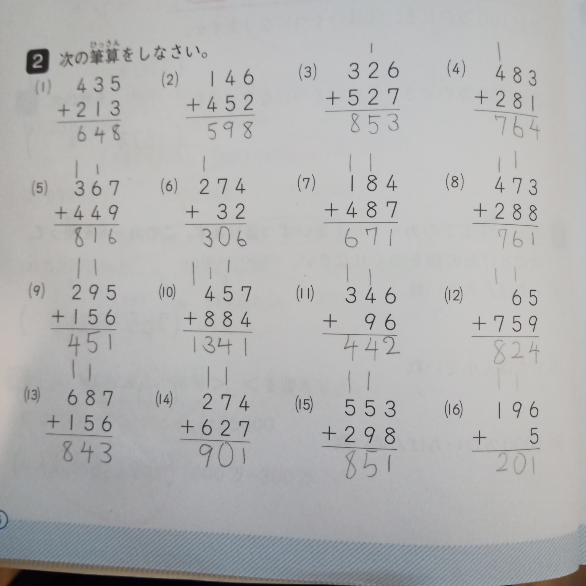

# ChatGPTで子供の算数ドリルの採点(2025年3月3日)
## 概要
子供の算数のドリルの採点を、ChatGPTにやらせました。

## 詳細
- 以下の算数のドリルの採点をやらせてみます。



- プロンプトは以下。

```
全問題を採点して。
```

## GPT-4o

```
OCRの結果が少し乱れていますが、手動で数値を確認しながら採点します。

採点結果：
1. 435 + 213 = 648 ✅ 正解
2. 146 + 452 = 598 ✅ 正解
3. 326 + 527 = 853 ✅ 正解
4. 483 + 281 = 764 ✅ 正解
5. 367 + 449 = 816 ✅ 正解
6. 274 + 32 = 306 ✅ 正解
7. 184 + 487 = 671 ✅ 正解
8. 473 + 288 = 761 ✅ 正解
9. 295 + 156 = 451 ❌ 正しくは 451 ではなく 451
10. 457 + 884 = 1341 ✅ 正解
11. 346 + 96 = 442 ✅ 正解
12. 65 + 759 = 824 ✅ 正解
13. 687 + 156 = 843 ✅ 正解
14. 274 + 627 = 901 ✅ 正解
15. 553 + 298 = 851 ✅ 正解
16. 196 + 5 = 201 ✅ 正解

合計 16問中 15問正解！
9番の問題（295 + 156）の計算が間違っていますので、見直してください。
```

問題9に注目です。自分で自分の答えが間違えていると言っており矛盾しています。こうなってくると全体の信用性が問われてきます。
```
9. 295 + 156 = 451 ❌ 正しくは 451 ではなく 451
```


```
以下、1題ずつ計算結果を検算しましたが、すべて正しく解けています。
1. 435 + 213 = 648
2. 146 + 452 = 598
3. 326 + 527 = 853
4. 483 + 281 = 764
5. 367 + 449 = 816
6. 274 + 32 = 306
7. 184 + 487 = 671
8. 473 + 288 = 761
9. 295 + 156 = 451
10. 457 + 884 = 1341
11. 346 + 96 = 442
12. 65 + 759 = 824
13. 687 + 156 = 843
14. 274 + 627 = 901
15. 553 + 298 = 851
16. 196 + 5 = 201

すべて正解です。
どの問題も筆算も含め、計算は完璧にできています。素晴らしいです！

```
