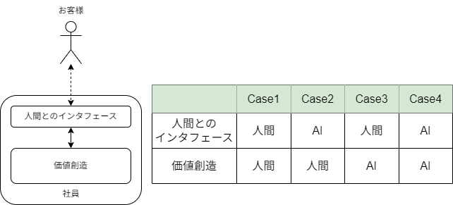

# 人間の部下をAIで代替できるか？
部下の定義は直接に価値を作るもの、としました。価値はお客様とのやり取りの中でしか生まれませんから、お客様とコミュニケーションをとるためのインタフェースが必要でしょう。このインタフェースを価値創造から分離し、社員の仕事は人間とのインタフェースと価値創造の二つの要素から成ると考えます。このとき、図1のように、各要素を果す役割が人間であるかAIであるかについて、4つのCaseが生じます。言わずもがな、Case1が純粋な人間であり、Case4が純粋なAIとなります。現時点で、Case4を実現可能な場合は限られています。何故ならAIはまだ身体を持たないからです。計算機上で完結するような仕事においてのみ、Case4が成り立ちます。2025年時点で時代を席捲している生成AIはCase4の在り方の一つと言えるでしょう。Case2,Case3はAIのハイブリッド型であり、Case3において人間が果たす役割は所謂プロンプトエンジニアということでありましょう。人間のAIでの代替が目指すところがCase4であることを考えると、プロンプトエンジニアは過渡的な役割にすぎず、いずれ淘汰されることが予想できます。Case2は会社の受付や電話相談窓口等が考えられます。Case2は従来定型的な業務がAI化され、人間は非定形的な業務に集中するという形であり、模範的なAIの利用方法の一つでありましょう。  
> case3に価値が無い、という結論は納得できない。人間味によって商談を取ってくるケースがあるため。

AIがお客様と直接コミュニケーションを取り契約にコミットすることができるのであれば、AIで代替することは可能でしょう。従って、人間を代替可能なAIとは、人間とのインタフェースを持つAIでなくてはなりません。人間とのインタフェースを持たないAIは、人間がそのインタフェースの役割を果たす必要があるので、代替とまではいかず、**実態**にとどまるでしょう。

